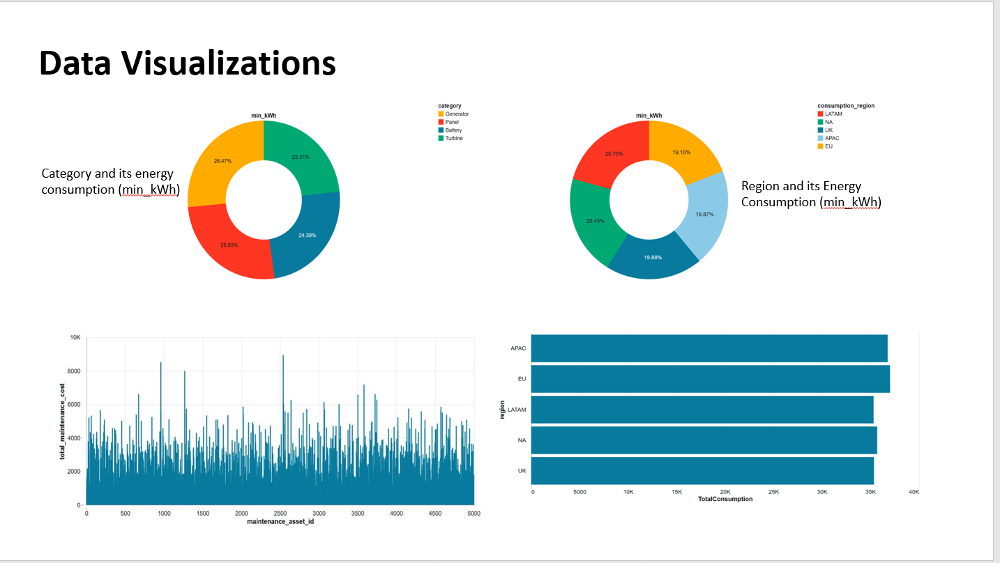

# Smart Energy Data Platform (SEDP)

## Overview
This project delivers a metadata-driven ingestion and processing framework for Voltix Energy using Azure Data Factory (ADF), Azure Databricks, and Azure Data Lake Storage Gen2 (ADLS). It integrates data from multiple sources into a unified analytics ecosystem, enabling real-time monitoring, predictive maintenance, and energy optimization.

## Requirements
- Build a dynamic ingestion framework capable of handling:
  - CSV, JSON, NDJSON (nested JSON) files.
  - Structured data from Azure SQL.
- Use ADF Switch/ForEach logic and parameterization for orchestration.
- Implement Databricks Auto Loader for incremental streaming ingestion.
- Maintain an Audit and Control framework for pipeline execution and watermark-based incremental loads.

## Architecture
- Orchestration: Azure Data Factory pipelines for dynamic routing and scheduling.
- Processing: Azure Databricks notebooks implementing Bronze, Silver, and Gold layers; Auto Loader for streaming NDJSON.
- Storage: ADLS Gen2 with landing, raw, curated, and archive zones; Delta tables for audit.
- Source Systems: Azure SQL (Asset Master & Control tables), CSV logs, JSON registries, NDJSON telemetry.

### Architecture Diagram

## Implemented Components
### 1. ADF – Dynamic Multi-File Ingestion (pl_dynamic_ingestion)
- Uses GetMetadata to list files in ADLS.
- ForEach iterates over files and extracts file_type.
- Switch routes to Databricks jobs:
  - Job_csv for CSV files.
  - Job_json for JSON files.
  - Job_ndjson for NDJSON files.
- Executes Silver and Gold layer jobs sequentially after Bronze ingestion.

### 2. ADF – Incremental SQL Ingestion (pl_incremental)
- Lookup reads control metadata (table, schema, watermark, status).
- ForEach sets variables and builds dynamic SQL queries:
  - Full load when IsIncremental = False.
  - Incremental load applies WHERE <WatermarkColumn> > <LastWatermarkValue>.
- Copy moves data from Azure SQL to ADLS.
- Script updates control table with new watermark and status.

### 3. Databricks – Bronze/Silver/Gold Layers
- Bronze: Raw landing for CSV (consumption summary, maintenance logs), JSON (asset registry), NDJSON (smart meter telemetry).
- Silver: Deduplication, timestamp normalization, enrichment, and column standardization; incremental strategy for telemetry.
- Gold: Dimensional modeling (facts & dimensions), joins, and aggregations for insights.

### 4. Streaming Telemetry – Auto Loader
- Uses spark.readStream.format("cloudFiles") with schema hints and evolution mode for incremental ingestion of NDJSON files.

### 5. Audit & Control Framework
- Pipeline_Run_Audit (Delta): Logs SourceType, FileName, Status, StartTime, EndTime for every run.
- ETL_Control_Table (SQL): Stores table-level metadata, watermark values, and updates post-run.

## How to Run
1. Configure Linked Services in ADF for Azure Databricks, ADLS Gen2, and Azure SQL.
2. Import pipelines:
   - sprint_adf_pipeline.json (multi-file ingestion).
   - adf_pl_incremental_sql.json (SQL incremental/full load).
3. Populate ETL_Control_Table with metadata (TableName, SchemaName, IsIncremental, WatermarkColumn, LastWatermarkValue, TargetPath, LoadStatus).
4. Ensure ADLS landing folders exist for all source types.
5. (Optional) Configure scheduled triggers for automated runs.

## Data Visualizations
Below are the key visual insights generated from the processed data:

## Outcomes
- A single, reusable pipeline design for multi-format files and SQL sources.
- Real-time telemetry ingestion via Auto Loader with schema evolution.
- Curated Silver and Gold datasets enabling consumption insights and maintenance analytics.

## ✅ Conclusion
The Smart Energy Data Platform successfully integrates diverse data sources into a unified analytics ecosystem.
Key achievements:
- Real-time ingestion of IoT telemetry using Auto Loader.
- Dynamic pipelines for multi-format files and incremental SQL loads.
- Curated Silver and Gold layers enabling actionable insights.
Impact:
- Enhanced operational efficiency through predictive maintenance.
- Improved energy optimization strategies using consumption analytics.
This solution provides a scalable foundation for Voltix Energy to leverage advanced analytics and machine learning in future phases.

## Sprint Timeline (4 Days)
- Day 1: ADF Linked Services and Parameter Setup.
- Day 2: Implement Dynamic Pipeline (Switch + ForEach).
- Day 3: Databricks Notebooks + Auto Loader + SQL Extraction.
- Day 4: Validation, Documentation, Demo.
